 

<table>
<tr>
<td width="370" valign="top">

</td>
<td width="490" valign="top">

</td>
</tr>
</table>

 

### `~/dhaminiteen08 $ whoami`

<!-- Add a couple of lines about yourself here. Keep it short --
     the info card above already carries the "now / prev / stack" story. -->

 

### `~/dhaminiteen08 $ ls socials/`

<!-- Add links: LinkedIn, portfolio, etc. -->

 

Portrait + info card are static (regenerate on photo/detail changes).
Heatmap refreshes daily via GitHub Actions.

